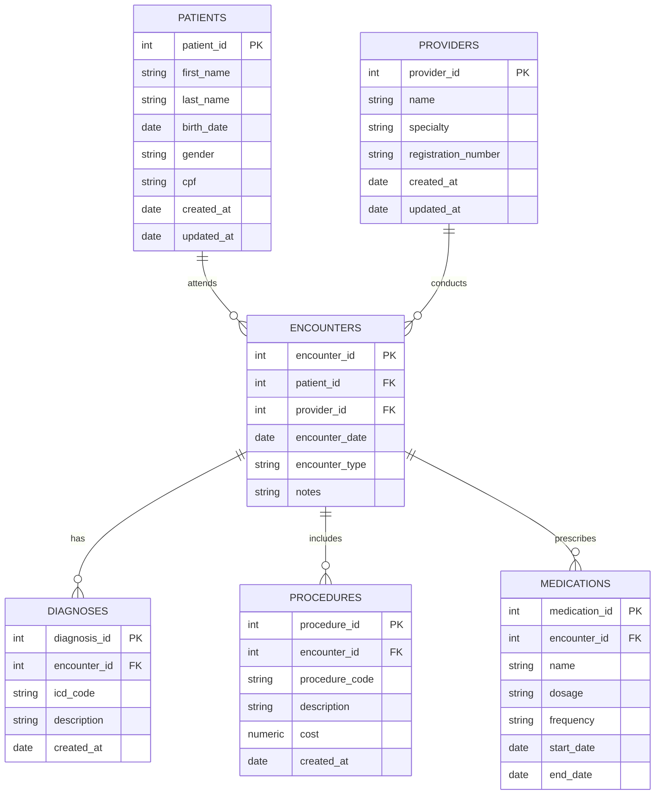

# 🧱 Healthcare DB Layer

Defines and initializes the PostgreSQL database for the **Healthcare Data Platform**, following a **Medallion Architecture** (Bronze → Silver → Gold).

---

## 🚀 Getting Started

### 1. Run PostgreSQL locally
```bash
cd docker
docker-compose up -d
````

This will:

* Start a PostgreSQL container
* Create schemas (`bronze`, `silver`, `gold`)
* Create normalized tables and seed initial data

### 2. Access the database

```bash
psql -h localhost -U healthcare -d healthcare
```

Password: `healthcare`

---

## 🧩 Architecture Overview

| Layer      | Description                                      | Example Tables                                           |
| ---------- | ------------------------------------------------ | -------------------------------------------------------- |
| **Bronze** | Raw data as ingested (JSON or CSV)               | `bronze.raw_events`                                      |
| **Silver** | Clean and normalized data (3NF)                  | `silver.patients`, `silver.admissions`, `silver.doctors` |
| **Gold**   | Analytical layer (aggregated materialized views) | `gold.admission_summary`                                 |

---

## 🧩 Database Schema — Silver Layer



## 🔄 Reset Database

To rebuild the environment:

```bash
docker-compose down -v
docker-compose up --build
```

---

## 🧠 Notes

* Designed for local or cloud deployment.
* Compatible with the **ingestion layer**, which loads data into Bronze and Silver tables.
* Can be extended with more views and indexes for analytics.
* Default PostgreSQL credentials can be changed in the `docker-compose.yml`.

---

## 📜 License

MIT License — free for personal and commercial use.
